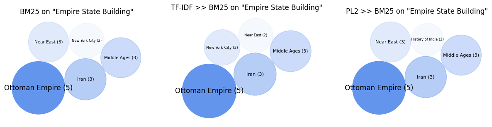
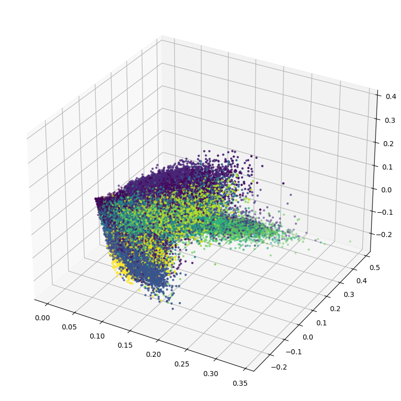

# BeerQA – Open-domain Question Answering Exploration

## 1) Introduction  

**Project Objective**  
The goal of this project is to explore the **BeerQA** benchmark for open-domain,
multi-hop question answering.  
The focus is on:

- understanding the structure and statistics of the dataset  
- building **information retrieval pipelines** with PyTerrier (BM25, TF–IDF, PL2)  
- analyzing the **semantic structure** of questions and documents using
  Word2Vec embeddings, dimensionality reduction and clustering  

The aim is not to build a full end-to-end QA model, but to study how retrieval
and semantic structure behave on a realistic multi-hop QA benchmark.

---

## 2) Dataset Description  

**Source**  
BeerQA is an open-domain question answering dataset built from existing QA
benchmarks and extended with new questions that
require **multiple Wikipedia pages** to answer.

Each example contains:

- a **question**
- one or more **answer strings**
- a set of **contexts** (Wikipedia paragraphs)
- metadata such as document titles and ids  

The training and development sets are built from existing datasets, while the
test set introduces new, harder multi-hop questions.

**Task**  
Given a question, the task is to retrieve and aggregate information from
multiple Wikipedia contexts in order to answer it correctly.

> **Note:** The BeerQA JSON files are **not included** in this repository.  
> Download them from the official source and place them under `data/beerqa/`
> (or update the paths accordingly).

---

## 3) Data Exploration  

The first part of the project is dedicated to **exploratory data analysis**:

- loading BeerQA JSON files (train, dev, test)  
- inspecting the structure of the `data` field (questions, contexts, titles)  
- computing basic statistics:
  - number of questions per split  
  - number of contexts per question  
  - distribution of question and context lengths  

This helps to understand how “multi-hop” the questions are and how large and
redundant the context collection is.

### 📊 Example: contexts per question
```json).  
{
  "id": "cf10ffbb5023cd0bc4637655458512b2186dc886",
  "src": "squad",
  "answers": [
    "Morales"
  ],
  "question": "Who came up with a policy for indigenous autonomy?",
  "context": [
    [
      "Indigenous peoples of the Americas",
      "Morales began work on his \"indigenous autonomy\" policy, which he launched in the eastern lowlands department on 3 August 2009. Bolivia was the first nation in the history of South America to affirm the right of indigenous people to self-government. Speaking in Santa Cruz Department, the President called it \"a historic day for the peasant and indigenous movement\", saying that, though he might make errors, he would \"never betray the fight started by our ancestors and the fight of the Bolivian people.\" A vote on further autonomy for jurisdictions took place in December 2009, at the same time as general elections to office. The issue divided the country."
    ]
  ]
}
```


## 4) Information Retrieval Pipelines with PyTerrier  

We build **sparse retrieval pipelines** using PyTerrier on top of the BeerQA
contexts.

**Indexing**

- create an index over the BeerQA contexts (text + title + ids)  
- use questions as queries to retrieve relevant paragraphs  

**Ranking Models**

We compare classic ranking models and combinations:

- **BM25** – standard baseline  
- **TF–IDF >> BM25** – pre-filter with TF–IDF, then re-rank with BM25  
- **PL2 >> BM25** – pre-filter with PL2, then re-rank with BM25  

For selected questions, we visually inspect the top-k retrieved documents and
how their ranking changes across pipelines.

### 🍺 Example: ranking visualization (bubble chart)



---

## 5) Word Embeddings Analysis (Word2Vec + t-SNE)  

To study the **semantic space** of BeerQA, we train a **Word2Vec** model on:

- questions  
- answers  
- contexts  

**Steps**

- tokenize text into sentences and words  
- train Word2Vec with a chosen vector size, window and `min_count`  
- inspect nearest neighbours of selected words  
- apply **t-SNE** to project word vectors into 2D or 3D  
- visualize how words cluster in embedding space  

This analysis highlights groups of semantically related terms (e.g. entities,
locations, topics) and gives an intuition of how meaningful the learned
embeddings are.

### 🧠 Example: Word2Vec embeddings (t-SNE projection)


---

## 6) Document Clustering  

We also explore **document-level clustering** to see how contexts group
semantically.

**Pipeline**

- build **TF–IDF** vectors for BeerQA contexts or merged documents  
- run **MiniBatchKMeans** for a chosen number of clusters  
- analyse:
  - inertia vs. number of clusters  
  - top terms per cluster  
  - example titles per cluster  

We then apply **t-SNE** on document vectors and color points by cluster label
to visualize high-level structure.

### 🌐 Example: document clusters (3D t-SNE)



This helps to understand whether contexts related to similar topics naturally
form coherent clusters (e.g. same series, same entity, same domain).
## 7) Conclusions 

**Key Insights**
- BeerQA provides a realistic testbed for multi-hop retrieval over Wikipedia.
- Classical IR models (BM25, TF–IDF, PL2) already show interesting behaviour
when combined into pipelines.
- Word2Vec embeddings and clustering reveal meaningful semantic structure
in questions and contexts.

## 📫 Contacts
- ✉️ Email: simone.logatto@outlook.com
- 🔗 LinkedIn: [Simone Lo Gatto](https://www.linkedin.com/in/simonelogatto/)
- 🐙 GitHub: @SimoneLoGatto00
